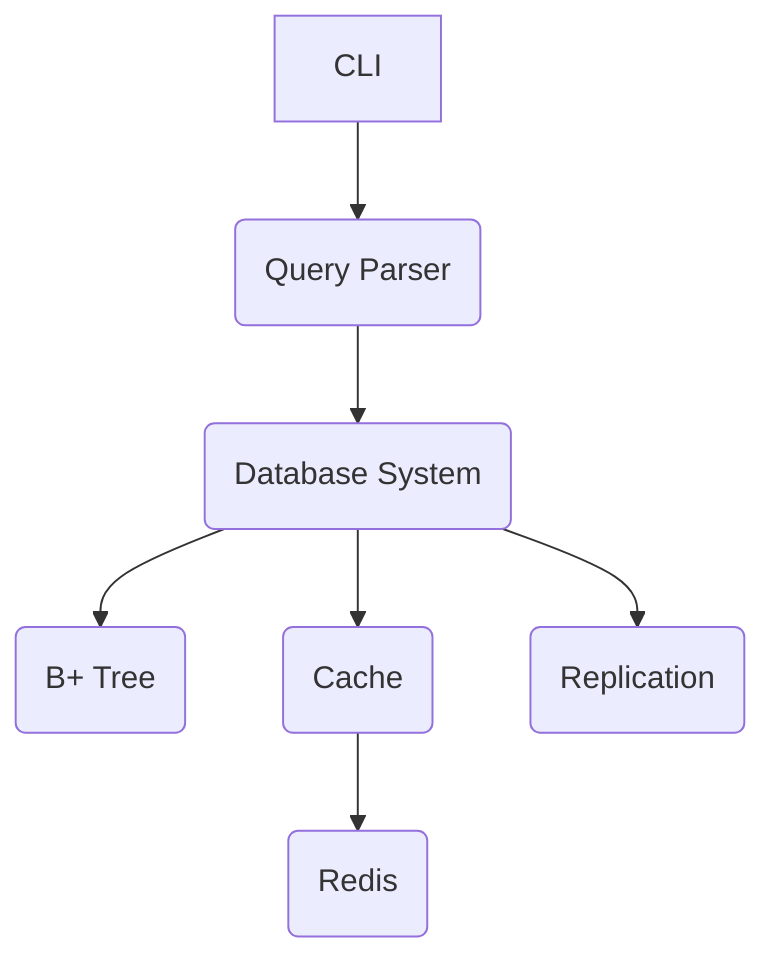

# Architecture Technique

## Aperçu

Le SGBDR est organisé en modules dans `src/` :

- **`core/`** : Noyau (stockage, transactions, index).
- **`utils/`** : Fonctions utilitaires (fichiers, logs).
- **`config/`** : Configuration et initialisation.
- **`managers/`** : Gestion des utilisateurs, sessions, sauvegardes.
- **`query/`** : Parsing SQL et NLP.
- **`interface/`** : CLI interactive.

## Flux de données

1. Une requête entre via `interface/cli.py`.
2. `query/query_parser.py` la traduit en opérations internes.
3. `core/database_system.py` exécute la requête avec `bplus_tree.py` pour l’indexation.
4. Les résultats sont mis en cache via `core/cache.py` (Redis).
5. `interface/cli.py` affiche le résultat.

## Fonctionnalités avancées

- **Time Travel** : Implémenté dans `database_system.py` avec des fichiers historiques.
- **Data Masking** : Ajout dynamique de fonctions de masquage dans les colonnes.
- **Row Level Security** : Activation de politiques d’accès au niveau des lignes.
- **MERGE** : Gestion des opérations d’UPSERT dans `query_parser.py`.
- **Window Functions** : Calculs avancés avec des partitions et des ordres.
- **JSON_TABLE** : Extraction et manipulation de données JSON.

## Technologies

- **Stockage** : Arbres B+ (`bplus_tree.py`), fichiers chiffrés.
- **Réseau** : SSL (`replication.py`), Redis.
- **NLP** : TensorFlow (`nlp_model.py`).
- **Parallélisme** : Numba, multiprocessing.

## Diagramme (Mermaid)

