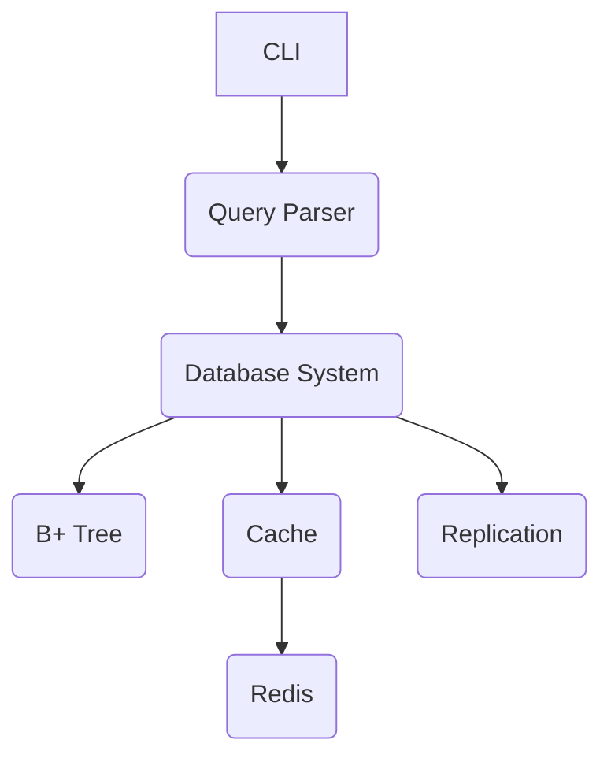

# Revenir au sommaire ← [Sommaire](./index.md)

# Architecture Technique

## Aperçu

Le SGBDR est organisé en modules dans `src/` :

- **`core/`** : Noyau (stockage, transactions, index).
- **`utils/`** : Fonctions utilitaires (fichiers, logs).
- **`config/`** : Configuration et initialisation.
- **`managers/`** : Gestion des utilisateurs, sessions, sauvegardes.
- **`query/`** : Parsing SQL et NLP.
- **`interface/`** : CLI interactive.

## Flux de données

1. Une requête entre via `interface/cli.py`.
2. `query/query_parser.py` la traduit en opérations internes.
3. `core/database_system.py` exécute la requête avec `bplus_tree.py` pour l’indexation.
4. Les résultats sont mis en cache via `core/cache.py` (Redis).
5. `interface/cli.py` affiche le résultat.

## Fonctionnalités avancées

- **Time Travel** : Permet d’interroger l’état d’une table à un instant passé. Utilisez la commande :

  ```sql
  SELECT * FROM <table> AS OF '<timestamp>';
  ```

  Exemple :

  ```sql
  SELECT * FROM users AS OF '2024-01-01T00:00:00';
  ```

  Cette fonctionnalité repose sur la journalisation des modifications dans `core/database_system.py` et la gestion des fichiers historiques. Elle est utile pour l’audit, la conformité et la restauration de données.

- **Data Masking** : Masque dynamiquement les colonnes sensibles pour certains utilisateurs. Activez-le avec :

  ```sql
  ALTER TABLE <table> ADD DATA MASKING ON <colonne> USING '<fonction>';
  ```

  Exemple :

  ```sql
  ALTER TABLE users ADD DATA MASKING ON email USING 'MASK_EMAIL';
  ```

  Le masquage est appliqué lors des requêtes selon les droits de l’utilisateur. Les fonctions de masquage sont définies dans le code et peuvent être personnalisées.

- **Row Level Security** : Applique des politiques d’accès au niveau des lignes. Activez-le avec :

  ```sql
  ALTER TABLE <table> ENABLE ROW LEVEL SECURITY;
  ```

  Exemple :

  ```sql
  ALTER TABLE users ENABLE ROW LEVEL SECURITY;
  ```

  Les règles de sécurité sont définies dans la configuration ou par des triggers personnalisés. Cela permet de restreindre l’accès à certaines lignes selon l’utilisateur ou le rôle.

- **MERGE (UPSERT)** : Permet de fusionner ou d’insérer des données selon qu’une correspondance existe. Utilisez :

  ```sql
  MERGE INTO <table_cible> USING <table_source> ON <condition>
  WHEN MATCHED THEN UPDATE SET ...
  WHEN NOT MATCHED THEN INSERT (...)
  VALUES (...);
  ```

  Exemple :

  ```sql
  MERGE INTO users USING new_users ON users.id = new_users.id
  WHEN MATCHED THEN UPDATE SET users.name = new_users.name
  WHEN NOT MATCHED THEN INSERT (id, name) VALUES (new_users.id, new_users.name);
  ```

  Cette commande est gérée dans `query/query_parser.py` et optimise les opérations d’import ou de synchronisation.

- **Window Functions** : Réalise des calculs avancés sur des partitions de données. Exemple :

  ```sql
  SELECT id, ROW_NUMBER() OVER (PARTITION BY department ORDER BY salary DESC) AS rang
  FROM employees;
  ```

  Permet de calculer des rangs, des moyennes mobiles, etc., sans sous-requêtes complexes.

- **JSON_TABLE** : Extrait et manipule des données JSON stockées dans une colonne. Exemple :

  ```sql
  SELECT * FROM users, JSON_TABLE(users.json_column, '$.path' COLUMNS (col1 INT PATH '$.field1'));
  ```

  Pratique pour travailler avec des données semi-structurées.

- **Recursive CTE** : Permet d’exécuter des requêtes récursives pour parcourir des structures hiérarchiques. Exemple :

  ```sql
  WITH RECURSIVE cte_name AS (
      SELECT id, parent_id FROM employees WHERE parent_id IS NULL
      UNION ALL
      SELECT e.id, e.parent_id FROM employees e
      INNER JOIN cte_name c ON e.parent_id = c.id
  )
  SELECT * FROM cte_name;
  ```

  Utile pour les arbres, graphes, ou la gestion de dépendances.

- **Query Hints** : Permet d’orienter l’optimiseur de requêtes. Exemple :
  ```sql
  SELECT /*+ USE INDEX */ * FROM users;
  ```
  Les hints sont interprétés par le parser et peuvent améliorer les performances sur de gros volumes.

## Technologies

- **Stockage** : Arbres B+ (`bplus_tree.py`), fichiers chiffrés.
- **Réseau** : SSL (`replication.py`), Redis.
- **NLP** : TensorFlow (`nlp_model.py`).
- **Parallélisme** : Numba, multiprocessing.

## Diagramme (Mermaid)


